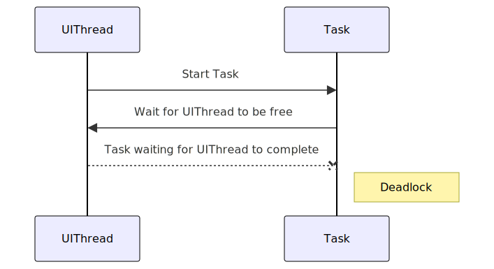

# Async Await Unravelled Demo

Unpack the secrets of async/await in C# without second-guessing your code structure.

## In a WPF Application

To demonstrate how the incorrect use of async/await can lock up the UI in a WPF application, you can create a simple WPF application with a button that simulates a long-running operation. The incorrect usage typically involves blocking the UI thread by using `.Result` or `.Wait()` on an asynchronous method.

Why does the UI lock up when using `.GetAwaiter().GetResult()`?

The reason why the `BadButton_Click` method still locks up the UI when using `GetAwaiter().GetResult()` is due to the way await and Task continuation work in combination with the `SynchronizationContext` in a WPF application.

### Detailed Explanation:

1. __SynchronizationContext__:

- WPF applications use a `SynchronizationContext` to manage the UI thread. This context ensures that UI updates happen on the UI thread.

2. __GetAwaiter().GetResult()__:

- `GetAwaiter().GetResult()` is a synchronous blocking call that waits for the task to complete. This call does not release the UI thread while it waits.

### Deadlock Scenario:

1. __UI Thread Starts Task__:

- The UI thread calls `LongRunningOperation()`, which returns a `Task` that is awaited using `GetAwaiter().GetResult()`. The UI thread is now blocked, waiting for the task to complete.

2. __Task Execution__:

- `LongRunningOperation` begins execution and runs asynchronously. When it encounters await `Task.Delay(5000)`, it schedules a continuation to resume execution after the delay.

3. __Continuation on UI Thread__:

- The continuation is posted back to the original SynchronizationContext (the UI thread) because await by default captures the SynchronizationContext. This means the continuation is queued to run on the UI thread.

4. __Deadlock__:

- The UI thread is blocked by GetAwaiter().GetResult(), waiting for the task to complete.
- The task cannot complete because its continuation needs to run on the UI thread, which is blocked.

This creates a classic deadlock where the UI thread is waiting for the task to complete, and the task is waiting for the UI thread to be free to run its continuation.

## In an ASP.NET MVC/API .NET Framework Application

Because .NET Framework based ASP.NET application employs a `SynchronizationContext` to manage threading, the above explanation applies.

## In an ASP.NET Core Application

Because .NET Core does not employ `SynchronizationContext` to manage threading, it is not suseptable to the deadlock problem.

However, using `Task.Result` or `Task.Wait` in a synchronous block such as a constructor, method, Action, or Func produces a phenomenon called "Sync of async" - the need to use 2 threads instead of 1 to complete synchronous operations.

